# Domain Models and Test Plan
### User Story 1
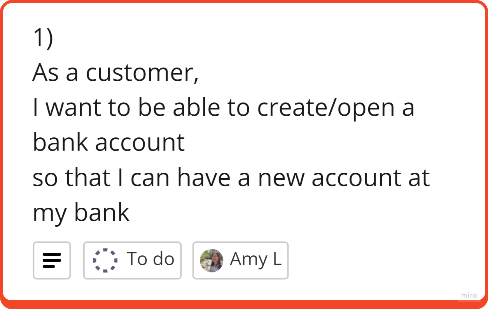

**Domain Model**
| Objects | Properties     | Messages                          | Output |
| ------- | -------------- | --------------------------------- | ------ |
| Bank | name @String Account @Object[] | createAccount() | @Boolean  |
| Account | accountId @Integer    |    |    |

**Tests**
- [ ] createAccount should return true if account was created
- [ ] accountId should be added to the new Account

### User Story 2
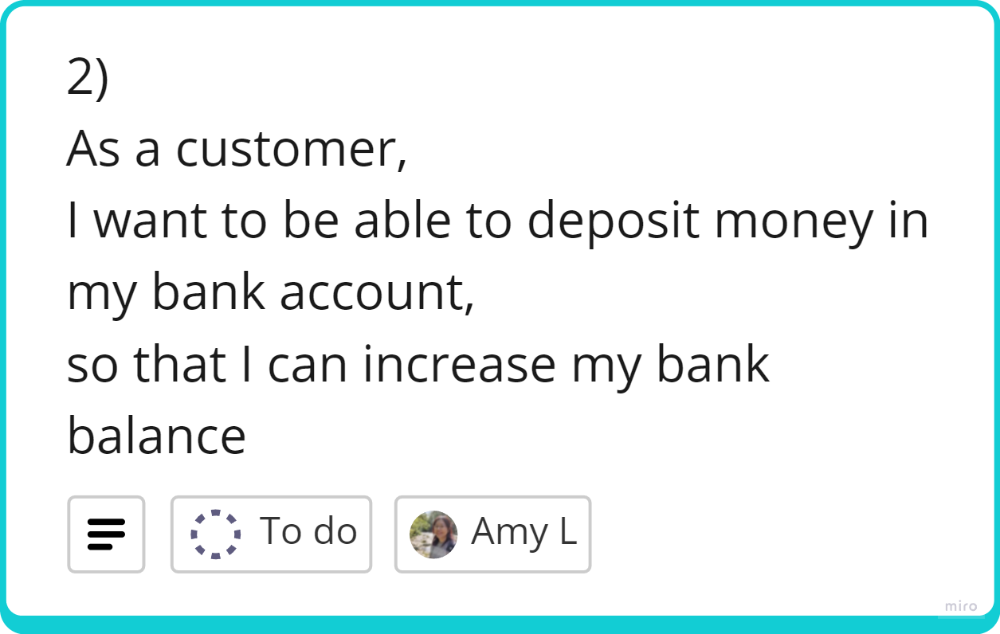

**Domain Model**
| Objects | Properties         | Messages                          | Output   |
| ------- | ------------------ | --------------------------------- | -------- |
| Account | balance @Integer statement @Array[@type, @amount, @date] | deposit(@Integer, @date) getBalance() | @Boolean         |

**Tests**
- [ ] deposit should return true if successful and money added to account
- [ ] balance in account should reflect increase in money deposited
- [ ] date of deposit should be shown as today's date unless otherwise

### User Story 3
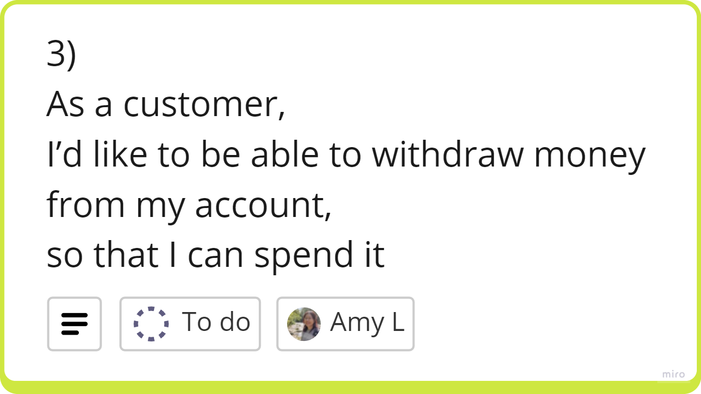

**Domain Model**
| Objects | Properties                                                           | Messages                             | Output   |
| ------- | -------------------------------------------------------------------- | ------------------------------------ | -------- |
| Account | balance @Integer statement @Array[@type, @amount, @date]          | withdraw(@Integer, @date) getBalance() | @Boolean |          |

**Tests**
- [ ] if amount is withdrawn successfully, return true
- [ ] withdraw should deduct the withdrawn amount from the balance
- [ ] date of withdraw should be shown as today's date unless otherwise

### User Story 4

**Domain Model**
| Objects | Properties                                                                    | Messages                              | Output   |
| ------- | ----------------------------------------------------------------------------- | ------------------------------------- | -------- |
| Account | balance @Integer statement @Array[@type, @amount, @date] | withdraw(@Integer, @date) | @Boolean |

**Tests**
- [ ] balance should not go past 0 if withdraw amount is more than balance
- [ ] withdrawal amount should withdraw up to the whole balance if it is more than bank balance

### User Story 5
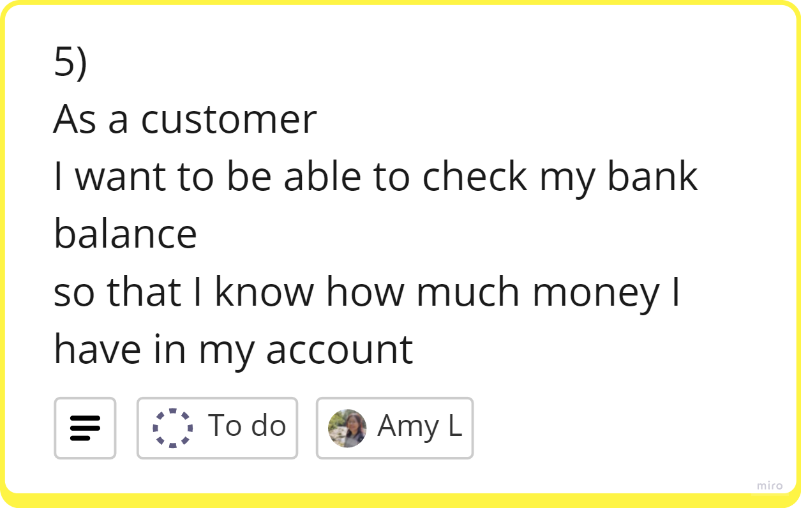

**Domain Model**
| Objects | Properties         | Messages                          | Output   |
| ------- | ------------------ | --------------------------------- | -------- |
| Account | balance @Integer   | getBalance()                      | @Integer |

**Tests**
- [ ] getBalance should return the amount of money currently in the account
- [ ] After depositing money, getBalance should increase by the amount deposited
- [ ] After withdrawing money, getBalance should decrease by the amount requested or up to the balance reaching 0.

### User Story 6
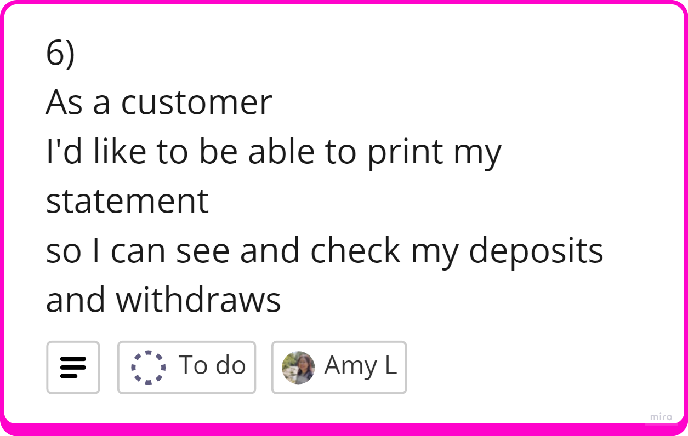

**Domain Model**
| Objects | Properties         | Messages                          | Output   |
| ------- | ------------------ | --------------------------------- | -------- |
| Account | statement @Array[@type, @amount, @date]| printStatement()      | @String         |

**Tests**
- [ ] printStatement should return all the transactions made to the account in chronological order
- [ ] after depositing money, printStatement should add the transaction details to the top of the list
- [ ] after withdrawing money, printStatement should add the transaction details to the top of the list

### User Story 7
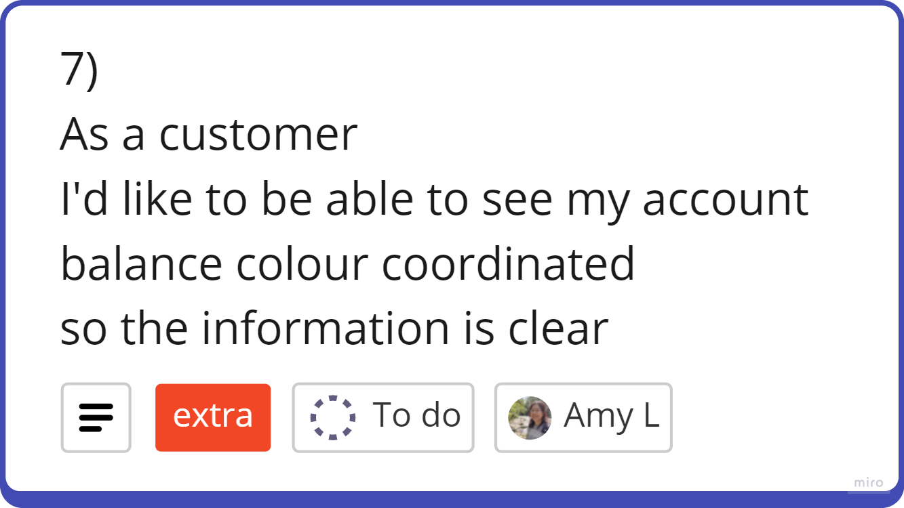

**Domain Model**
| Objects | Properties         | Messages                          | Output   |
| ------- | ------------------ | --------------------------------- | -------- |
| Account | statement @Array[@type, @amount, @date] | printStatement()                                  | @String         |

**Tests**
- [ ] The output of the statement should be formatted so credits and positive balances appear in green text
- [ ] The output of the statement should be formatted so debits and negative balances appear in red text

### User Story 8
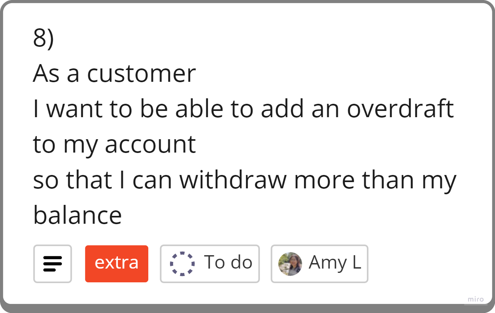

**Domain Model**
| Objects | Properties         | Messages                          | Output   |
| ------- | ------------------ | --------------------------------- | -------- |
| Account | overdraft @Integer | addOverdraft()                    | @Boolean |

**Tests**
- [ ] addOverdraft should return true when an overdraft is added to the account

### User Story 9
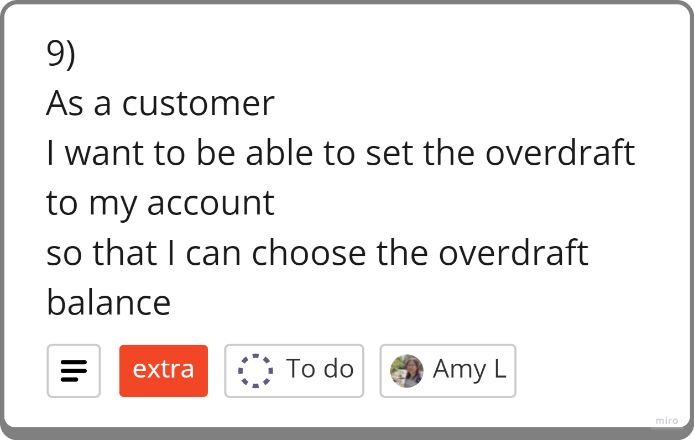

**Domain Model**
| Objects | Properties         | Messages                          | Output   |
| ------- | ------------------ | --------------------------------- | -------- |
| Account | overdraft @Integer | addOverdraft(@Integer)            | @Boolean |

**Tests**
- [ ] addOverdraft should pass through a value which sets the overdraft limit as entered

### User Story 10
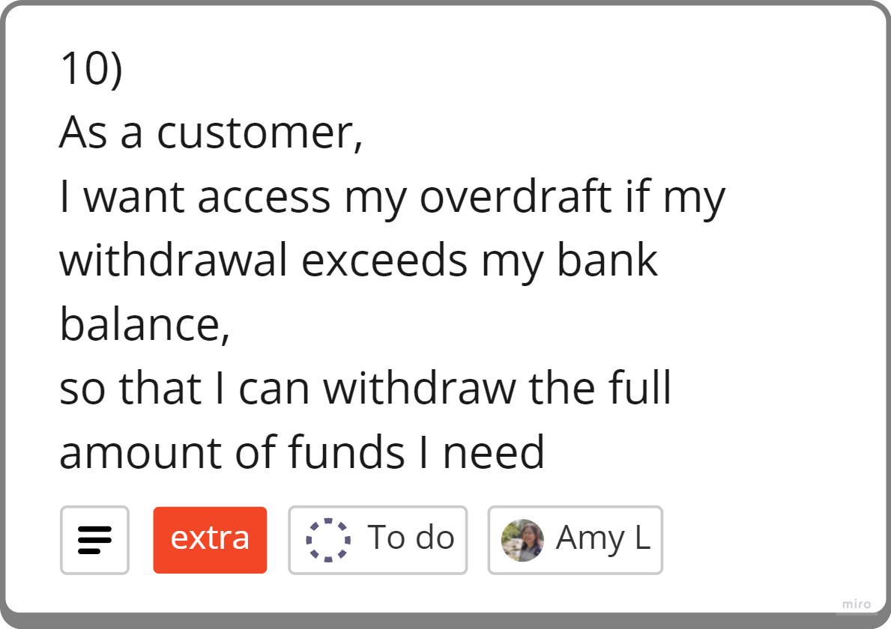

**Domain Model**
| Objects | Properties         | Messages                          | Output   |
| ------- | ------------------ | --------------------------------- | -------- |
| Account | overdraft @Integer balance @Int | withdraw(@Integer)| @Boolean |

**Tests**
- [ ] If account has an overdraft set, allow the customer to withdraw money past their available balance.
- [ ] When withdraw is called, overdraft should not exceed the overdraft limit set.

### User Story 11
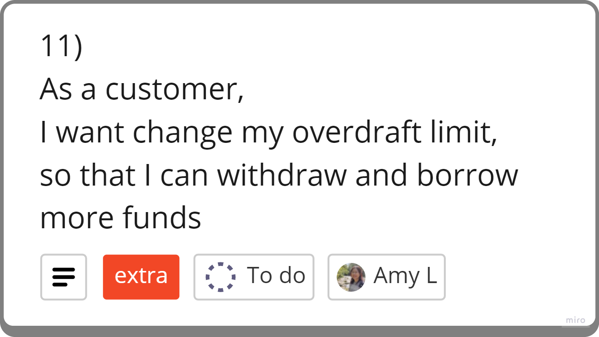

**Domain Model**
| Objects | Properties         | Messages                          | Output   |
| ------- | ------------------ | --------------------------------- | -------- |
| Account | overdraft @Integer | setOverdraft(@Integer)            | @Boolean |

**Tests**
- [ ] If account has an overdraft set, setOverdraft should change the overdraft balance to the new value.
- [ ] If account has an overdraft set, setOverdraft should not change the overdraft limit lower than the current balance.

## Kanban Board
I used a kanban board on Miro to help organise my user stories and production tickets.\
See Miro Board: <https://miro.com/app/board/uXjVKP-w-MM=/?share_link_id=534173247809>

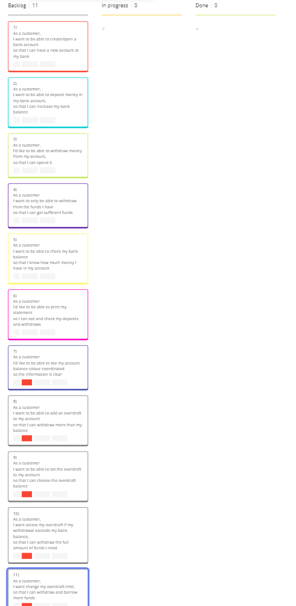