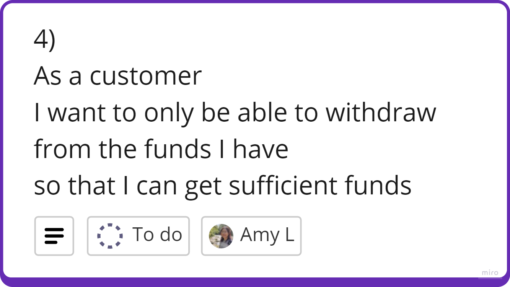

# Domain Models and Test Plan
### User Story 1

**Domain Model**
| Objects | Properties     | Messages                          | Output |
| ------- | -------------- | --------------------------------- | ------ |
| Bank | Account @Object[] | createAccount(accountId @Integer) | @Boolean  |
| Account | accountId @Integer    |    |    |

**Tests**
- [ ] createAccount should return true if account was created
- [ ] createAccount should increase the length of Account array by 1

### User Story 2

**Domain Model**
| Objects | Properties         | Messages                          | Output   |
| ------- | ------------------ | --------------------------------- | -------- |
| Account | accountId @Integer balance @Integer statement @Array[@type, @amount, @date] | deposit(@accountId, @Integer, @date) | @Boolean         |

**Tests**
- [ ] deposit should only be deposited to an matching account
- [ ] deposit should return true if successful and money added to account
- [ ] balance in account should reflect increase in money deposited

### User Story 3

**Domain Model**
| Objects | Properties                                                                    | Messages                             | Output   |
| ------- | ----------------------------------------------------------------------------- | ------------------------------------ | -------- |
| Account | accountId @Integer balance @Integer statement @Array[@type, @amount, @date] | withdraw(@accountId, @Integer, @date) | @Boolean |

**Tests**
- [ ] withdraw should only withdrawn from matching account
- [ ] withdraw should deduct the withdrawn amount from the balance
- [ ] if amount is withdrawn successfully, return true

### User Story 4

**Domain Model**
| Objects | Properties                                                                    | Messages                              | Output   |
| ------- | ----------------------------------------------------------------------------- | ------------------------------------- | -------- |
| Account | accountId @Integer balance @Integer statement @Array[@type, @amount, @date] | withdraw(@accountId, @Integer, @date) | @Boolean |

**Tests**
- [ ] balance should not go past 0 if withdraw amount is more than balance
- [ ] withdrawal amount should withdraw up to the whole balance if it is more than bank balance

### User Story 5

**Domain Model**
| Objects | Properties         | Messages                          | Output   |
| ------- | ------------------ | --------------------------------- | -------- |
| Account | balance @Integer  accountId @Integer   | getBalance(accountId @Integer)        | @Integer |

**Tests**
- [ ] getBalance should return the amount of money currently in the account
- [ ] After depositing money, getBalance should increase by the amount deposited
- [ ] After withdrawing money, getBalance should decrease by the amount requested or up to the balance reaching 0.
- [ ] getBalance should shown an error is account doesn't exist

### User Story 6

**Domain Model**
| Objects | Properties         | Messages                          | Output   |
| ------- | ------------------ | --------------------------------- | -------- |
| Account | statement @Array[@type, @amount, @date]  accountId @Integer | printStatement(accountId @Int)                              | @String         |

**Tests**
- [ ] printStatement should return all the transactions made to the account in chronological order
- [ ] after depositing money, printStatement should add the transaction details to the top of the list
- [ ] after withdrawing money, printStatement should add the transaction details to the top of the list

## Kanban Board
I used a kanban board on Miro to help organise my user stories and production tickets.\
See Miro Board: <https://miro.com/app/board/uXjVKP-w-MM=/?share_link_id=534173247809>

